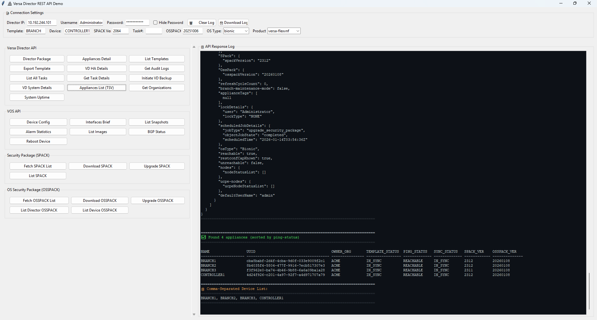

Versa-REST-API-Demo

Versa-REST-API-Demo simplifies Versa Director API testing with an intuitive GUI interface. Perfect for network engineers, automation developers, and anyone working with Versa SD-WAN infrastructure.

Author: Rengaramalingam A
Email:  rengahcl@gmail.com, rengaramalingam.a@versa-networks.com
LinkedIn: https://www.linkedin.com/in/rengaramalingama/

DISCLAIMER:
-----------
This script is provided "AS IS" without warranty of any kind, express or implied.
Use at your own risk. The author is not responsible for any damage, data loss, 
or issues arising from the use of this script. Always test in a non-production 
environment first.

Key Features:

- Multiple Ready-to-Use API Endpoints - Organized by category for easy navigation
- One-Click Execution - Run APIs instantly with real-time response logging
- Auto-Generated CURL Commands - Perfect for scripting and documentation
- Security Package Management - SPACK/OSSPACK workflows built-in
- Device Configuration - Export configs and monitor device status
- Task Tracking - Automatic status updates and monitoring
- Modern UI - Dark-themed interface with syntax-highlighted output
- Minimal Dependencies - Only Python standard library + requests module

Screenshots:
------------

Main Interface:

API Response Viewer:

API Categories & Endpoints:
---------------------------

VERSA DIRECTOR API (13 endpoints):
  - Director Package Info     : GET /api/operational/system/package-info
  - Appliances Detail         : GET /vnms/appliance/appliance/lite
  - List Templates            : GET /vnms/sdwan/workflow/templates
  - Export Template           : GET /vnms/template/export
  - VD HA Details             : POST /api/config/vnmsha/actions/_operations/get-vnmsha-details
  - Get Audit Logs            : GET /vnms/audit/logs
  - List All Tasks            : GET /vnms/tasks
  - Get Task Details          : GET /vnms/tasks/task/{task_number}
  - Initiate VD Backup        : POST /api/config/system/recovery/backup/_operations
  - VD System Details         : GET /vnms/dashboard/vdStatus/sysDetails
  - Appliances List (TSV)     : GET /vnms/appliance/appliance/lite (formatted)
  - Get Organizations         : GET /nextgen/organization
  - System Uptime             : GET /vnms/system/uptime

VOS API (7 endpoints):
  - Device Config             : GET /vnms/appliance/export
  - Interfaces Brief          : GET /api/operational/devices/device/{device}/live-status/interfaces/brief
  - List Snapshots            : GET /api/operational/devices/device/{device}/live-status/system/snapshots
  - Alarm Statistics          : GET /api/operational/devices/device/{device}/live-status/alarms/statistics/detail
  - List Images               : POST /api/config/devices/device/{device}/config/system/package/list/_operations
  - BGP Status                : GET /api/operational/devices/device/{device}/live-status/bgp/neighbors/brief
  - Reboot Device             : POST /api/config/devices/device/{device}/config/system/_operations/reboot

SECURITY PACKAGE - SPACK (4 endpoints):
  - Fetch SPACK List          : GET /vnms/spack/checkavailableupdates
  - Download SPACK            : POST /vnms/spack/download
  - Upgrade SPACK             : POST /vnms/spack/schedule/updateAppliance
  - List SPACK                : GET /nextgen/spack/downloads

OS SECURITY PACKAGE - OSSPACK (5 endpoints):
  - Fetch OSSPACK List        : GET /vnms/osspack/device/check-osspack-updates
  - Download OSSPACK          : POST /vnms/osspack/download
  - Upgrade OSSPACK           : POST /vnms/osspack/schedule/updateAppliance
  - List Director OSSPACK     : GET /vnms/osspack/director/all-downloads
  - List Device OSSPACK       : GET /vnms/osspack/device/all-downloads

Getting Started:

Installation

1. Clone the repository:

git clone https://github.com/RengarDevOps/Versa-REST-API-Demo.git
cd Versa-REST-API-Demo

2. Install dependencies:

pip install requests

3. Run the application:

python versa_rest_demo.py

Requirements:

- Python 3.x
- requests library

Use Cases:

- Testing Versa Director API endpoints
- Learning Versa SD-WAN API workflows
- Generating API documentation
- Prototyping automation scripts
- Troubleshooting API integrations

License:

MIT License - Free to use and modify for your needs.

Disclaimer:

This tool is for testing and educational purposes. Always follow your organization's security policies when using API credentials.